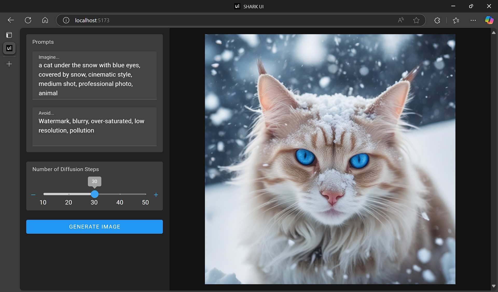

# AMD-SHARK UI

## Introduction

Welcome to AMD-SHARK UI! This repo contains a basic app to demonstrate how to use the [Shortfin](https://github.com/nod-ai/amd-shark-ai/tree/main/shortfin) Web APIs for text-to-image and text-to-text inference.

## Preview

## Setup

- [For users](docs/setup/for_users.md)
- [For developers](docs/setup/for_developers.md)

## Deployment

DISCLAIMER: this application is for demonstration purposes only and is not intended for production environments

## Need Anything?

- [Create an issue](https://github.com/nod-ai/amd-shark-ui/issues)
