# Barrel Files with Directory Modules

This document describes the conventions for naming and using "barrel" files within directory-based modules.

## Context

To see why barrel files might be needed, see ["Selecting a Module Structure"](../selecting-structure.md).

## Terms

A "barrel" file is one that:

- re-exports the symbols of its peers
- has no declarations of its own
- avoids any side-effects

## Flow

The figure below illustrates how the contents of a module are accessed by external modules

```mermaid
flowchart TB
  ExternalModules(External Modules)

  %% Object-oriented (assembled path)
  Files_Definition["/definition.*.ts"]

  %% Primary export (single node fed by both strategies)
  File_ExportsObjectPrimary["/exports.object.primary.ts"]

  %% Auxiliaries and toolbox
  File_ExportsObjectAuxiliaries["/exports.object.auxiliaries.ts"]
  File_ExportsToolbox["/exports.toolbox.ts"]

  %% Entry point
  File_Index["/index.ts"]

  %% Core source peers
  InternalModules(Internal Modules)

  %% Graphs
  ExternalModules --> File_Index

  File_Index --> File_ExportsObjectPrimary & File_ExportsObjectAuxiliaries & File_ExportsToolbox

  File_ExportsObjectPrimary     --> Files_Definition --> InternalModules
  File_ExportsObjectAuxiliaries --->                     InternalModules
  File_ExportsToolbox           --->                     InternalModules

  %% Styling
  classDef definitionFigure fill:#333   ,           ;
  classDef exports          fill:#fff4d6, color:#000;
  classDef entry            fill:#eaffea, color:#000;

  class File_ExportsObjectPrimary,File_ExportsObjectAuxiliaries,File_ExportsToolbox exports;
  class Files_Definition definitionFigure;
  class File_Index entry;
```

### Legend

- `/index.ts`:
  - Marks the entry point into the module for the bundler to resolve
- `/exports.*.ts`:
  - Curates what is exposed to external modules

## Handling Different Paradigms

### For object-oriented modules

- `/index.ts`:
  - **If at top level of a library**: determines which symbol should be designated `default`
- `/exports.object.primary.ts`:
  - States whether the primary object for the module is "declared" or "assembled".
- `/exports.object.auxiliaries.ts`:
  - States any objects or pure functions that compliment (but cannot be nested within) the primary object

### For functional modules

- `/exports.toolbox.ts`:
  - Lists all the "tools" that should be exposed to external modules
