# Definitions for Object-Oriented Directory-Based Modules

This document describes how to define the core implementation of an object-oriented module that has a directory-based structure.

## Context

To see how this helps expose functionality to external consumers, read about [barrel files](./barrel-files.md).

## Terms

Within the confines of this project, a "definition" is a TypeScript symbol that represents the core implementation within an object-oriented module.

Ergo, a definition _file_ is one that _creates_ the definition.

For example, in the `/User/` module, it might be specified as the `User` class declaration found in `/User/definition.declared.ts`.

## Flow

The figure below illustrates how the core implementation of an object-oriented module is defined based on whether it's assembled or declared, and whether augmentation is needed.

```mermaid
flowchart TB
  %% Primary export (single node fed by both strategies)
  File_ExportsObjectPrimary["/exports.object.primary.ts"]

  Decision_PrimaryObject@{ shape: diamond, label: "Does the primary object require a TypeScript declaration?" }
  Decision_Augmentation@{ shape: diamond, label: "Need augmentation?" }

  %% Object-oriented (assembled path)
  File_DefinitionAssembledMembers["/definition.assembled.members.ts"]
  File_DefinitionAssembled["/definition.assembled.ts"]

  %% Object-oriented (declared path + optional augmentation)
  File_DefinitionDeclared["/definition.declared.ts"]
  File_DefinitionDeclaredAugmentation["/definition.declared.augmentation.ts"]
  File_DefinitionDeclaredWithAugmentation["/definition.declared.withAugmentation.ts"]

  Junction_End@{ shape: f-circ }

  %% Core source peers
  InternalModules(Internal Modules)

  %% Graphs
  File_ExportsObjectPrimary --> Decision_PrimaryObject

  subgraph Files_Definition [" "]
    Decision_PrimaryObject ==yes==> Decision_Augmentation
    Decision_PrimaryObject ==no ==> File_DefinitionAssembled

    Decision_Augmentation ==no ==> File_DefinitionDeclared
    Decision_Augmentation ==yes==> File_DefinitionDeclaredWithAugmentation 

    File_DefinitionDeclaredWithAugmentation --> File_DefinitionDeclared
    File_DefinitionDeclaredWithAugmentation --> File_DefinitionDeclaredAugmentation -.-> File_DefinitionDeclared
    File_DefinitionAssembled                --> File_DefinitionAssembledMembers 

    File_DefinitionDeclaredAugmentation --- Junction_End
    File_DefinitionDeclared             --- Junction_End
    File_DefinitionAssembledMembers     --- Junction_End
  end

  Junction_End --> InternalModules

  %% Styling
  classDef definitionSubgraph fill:#333   ,           ;
  classDef definition         fill:#eef   , color:#000;
  classDef exports            fill:#fff4d6, color:#000;
  classDef decision           fill:#9b3333, color:#fff;

  class File_DefinitionAssembledMembers,File_DefinitionAssembled,File_DefinitionDeclared,File_DefinitionDeclaredAugmentation,File_DefinitionDeclaredWithAugmentation definition;
  class File_ExportsObjectPrimary exports;
  class Files_Definition definitionSubgraph;
  class Decision_Augmentation,Decision_PrimaryObject decision;
```

### Legend

## Strategies

### Choosing a Strategy

### Switching Strategies
