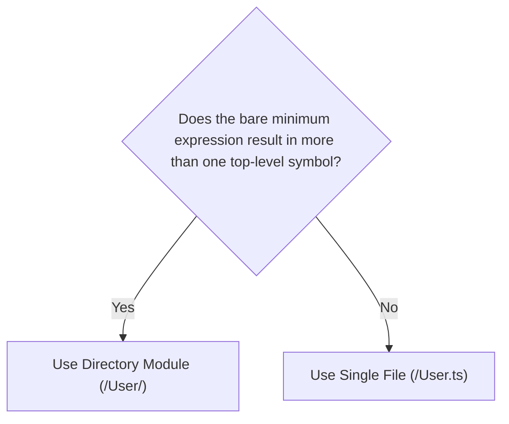

# Selecting a Module Structure

This document outlines how to choose whether a module should be single-file or directory-based.

## Goal

To make it easier to:

1. change the implementation of a module without affecting its public API
1. facilitate the onboarding of new contributors through simple, narrowly-scoped structure
1. keep the codebase primed for the addition of new features

## When to Split vs. Consolidate

Choosing between a single-file or directory-based module structure is simple:



Modules that no longer meet the criteria for a single-file structure should be split into a directory-based structure. Conversely, modules that can be expressed in a single file should be consolidated.

### Terms

- "symbol": the identifier assigned to a single declaration or a group of merged declarations
  - a `class` declaration
  - an `enum` declaration
  - a `function` declaration
  - a `const` declaration
  - a `type` or `interface` declaration
    - can be merged with a `function` or `const` declaration with the same identifier
- "top-level": not nested within another declaration
- "bare minimum expression": the simplest possible way to describe functionality that still meets the module's requirements
  - i.e. using object literals instead of `class` declarations that have nothing but `static` members

## Example

### A Simple Case

Say we had a single-file module:

```plaintext
src/
├─ User.ts
```

In this module, everything about a `User` can be described in a single class declaration:

```typescript
// User.ts

class User {
  public constructor(
    public readonly handle: string,
  ) {}
}

export {
  User as default,
};
```

And using it is straightforward:

```typescript
import User from './User';

const someUser = new User('@JohnDoe');
```

This same module _could_ be split into a directory structure, without affecting consumption:

```plaintext
src/
├─ User
  ├─ definition.declared.ts    # Defines what a `User` is via a class declaration
  ├─ exports.object.primary.ts # Identifies the primary object to expose to consumers
  ├─ index.ts                  # Exposes the primary object as the `default` export from the entire module 
```

But it would be _excessive_ until a valid need actually presented itself, such as:

- custom member types
  - e.g. `User.Handle`
- nested classes
  - e.g. `const someError = new User.ParsingError(...)`
- nested types that require module augmentation
  - e.g. `type SomeError = User.ParsingError`
- declaration merging
  - e.g. an `enum` that's given static methods
- multiple symbols to export
- etc.

In fact, a directory structure like the one above would suggest that the module should be simplified into a single file, leaving us once again with:

```plaintext
src/
├─ User.ts
```

### A Simple Case Becomes Complex

Now, let's say that we add some parsing functionality to our `User` module:

```typescript
// User.ts

import Attempt from '@/library/Attempt';
import type Parsable from '@/library/Parsable';
import ParsingError from '@/library/ParsingError';

class User_ParsingError
  extends ParsingError<
    'User'
  >
{
  ...
}

class User
  implements Parsable.String<
    typeof User,
    /*  */ User_ParsingError
  >
{
  public constructor(
    public readonly handle: string,
  ) {}

  public static parsedFrom(
    givenSubject: string,
  ): Attempt.Outcome<
    User,
    User_ParsingError
  > {
    return Attempt.Fresh.that(ends => {
      ...

      if (
        rawHandle.startsWith('@')
      ) return ends.inSuccessWith(parsedUser);
      
      const newParsingError = new User_ParsingError('Expected handle to start with "@"');
      return ends.inFailureWith(newParsingError);

    });
  }
}

export {
  User as default,
  User_ParsingError,
};
```

By adding a single concept ("parsing"), the module has tripled in length and gained several new responsibilities:

- Importing necessary tools from the library.
- Defining a new error type for parsing failures.
- Exporting the new error type alongside the `User` class so consumers can identify those issues if they so choose.

And because this module is a single file, we can't create `User.ParsingError` for easy consumer access without making the file even longer.

We can now justify splitting the module into a directory to better organize its components:

```plaintext
src/
├─ library/
├─ User/
  ├─ ParsingError.ts                         # Holds the `User_ParsingError` class
  ├─ definition.declared.ts                  # Defines the `User` class
  ├─ definition.declared.augmentation.ts     # Augments the `User` class with `User.ParsingError` type/constructor
  ├─ definition.declared.withAugmentation.ts # Presents the augmented `User` class
  ├─ exports.object.primary.ts               # Permits exposure of `User` (with nested `ParsingError`) to consumers
  ├─ index.ts                                # Presents the final `User` object as the `default` export from the entire module
```

This leaves the core file with only a single declaration, narrowing its focus as much as possible:

```typescript
// User/definition.declared.ts

import Attempt from '@/library/Attempt';
import type Parsable from '@/library/Parsable';

import {
  User_ParsingError
} from './ParsingError';

class User
  implements Parsable.String<
    typeof User,
    /*  */ User_ParsingError
  >
{
  public constructor(
    public readonly handle: string,
  ) {}

  public static parsedFrom(
    givenSubject: string,
  ): Attempt.Outcome<
    User,
    User_ParsingError
  > {
    return Attempt.Fresh.that(ends => {
      ...

      if (
        rawHandle.startsWith('@')
      ) return ends.inSuccessWith(parsedUser);

      const newParsingError = new User_ParsingError('Expected handle to start with "@"');
      return ends.inFailureWith(newParsingError);
    });
  }
}

export {
  User,
};
```

**By using the directory structure**:

- tests can be written without confounding primary behavior, internal behavior, the shape of the API, etc.
- contributors have an easier time reading and understanding the purpose of the module
- further growth has a place to go without cluttering the core concept

## Summary

By following these guidelines, contributors can:

- keep APIs intact for consumers while offering additional functionality
- prevent premature modularization
- manage the chaos of multiple declarations and exports
- encourage clear test boundaries
- support long-term maintainability

> **Start simple.** Split only when complexity warrants it.
