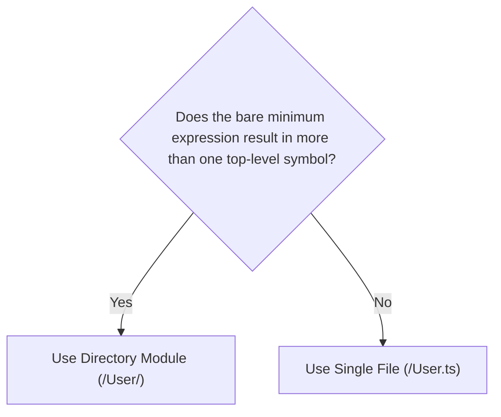

# Selecting a Module Structure

This document outlines how to choose whether a module should be single-file or directory-based.

## Goal

To make it easier to:

1. change the implementation of a module without affecting its public API
1. facilitate the onboarding of new contributors through simple, narrowly-scoped structure
1. keep the codebase primed for the addition of new features

## When to Split vs. Consolidate

Choosing between a single-file or directory-based module structure is simple:

Modules that no longer meet the criteria for a single-file structure should be split into a directory-based structure. Conversely, modules that can be expressed in a single file should be consolidated.

### Terms

- "symbol": the identifier assigned to a single declaration or a group of merged declarations
  - a `class` declaration
  - an `enum` declaration
  - a `function` declaration
  - a `const` declaration
  - a `type` or `interface` declaration
    - can be merged with a `function` or `const` declaration with the same identifier
- "top-level": not nested within another declaration
- "bare minimum expression": the simplest possible way to describe functionality that still meets the module's requirements
  - i.e. using object literals instead of `class` declarations that have nothing but `static` members

## Example

### A Simple Case

### A Simple Case Becomes Complex

## Summary
