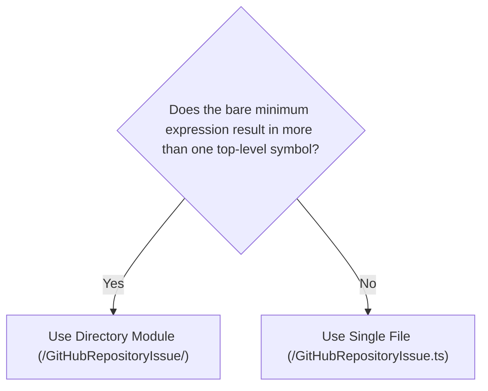

# Selecting a Module Structure

This document outlines how to choose whether a module should be single-file or directory-based.

## Goal

To make it easier to:

1. change the implementation of a module without affecting its public API
1. facilitate the onboarding of new contributors through simple, narrowly-scoped structure
1. keep the codebase primed for the addition of new features

## When to Split vs. Consolidate

Choosing between a single-file or directory-based module structure is simple:



Modules that no longer meet the criteria for a single-file structure should be split into a directory-based structure. Conversely, modules that can be expressed in a single file should be consolidated.

### Terms

- "symbol": the identifier assigned to a single declaration or a group of merged declarations
  - a `class` declaration
  - an `enum` declaration
  - a `function` declaration
  - a `const` declaration
  - a `type` or `interface` declaration
    - can be merged with a `function` or `const` declaration with the same identifier
- "top-level": not nested within another declaration
- "bare minimum expression": the simplest possible way to describe functionality that still meets the module's requirements
  - i.e. using object literals instead of `class` declarations that have nothing but `static` members

## Example

### A Simple Case

Say we had a single-file module:

```plaintext
src/
├─ GitHubRepositoryIssue.ts
```

In this module, everything about a `GitHubRepositoryIssue` can be described in a single class declaration:

```typescript
// GitHubRepositoryIssue.ts

class GitHubRepositoryIssue
{
  public constructor(
    public title: string,
    public body: string,
    /** a.k.a. "type" */
    public category:
      | 'Feature'
      | 'Bug'
      | 'Task',
  ) {}
}

export {
  GitHubRepositoryIssue as default,
};
```

And using it is straightforward:

```typescript
import GitHubRepositoryIssue from './GitHubRepositoryIssue';

const someIssue = new GitHubRepositoryIssue(
  'refactor: clean up modules',
  '...',
  'Task',
);
```

This same module _could_ be split into a directory structure, without affecting consumption:

```plaintext
src/
├─ GitHubRepositoryIssue
  ├─ definition.declared.ts    # Defines what a `GitHubRepositoryIssue` is via a class declaration
  ├─ exports.object.primary.ts # Identifies the primary object to expose to consumers
  ├─ index.ts                  # Exposes the primary object as the `default` export from the entire module 
```

But it would be _excessive_ until a valid need actually presented itself, such as:

- custom member types
  - e.g. `GitHubRepositoryIssue.Label`
- nested classes
  - e.g. `const someError = new GitHubRepositoryIssue.DraftingError(...)`
- nested types that require module augmentation
  - e.g. `type SomeError = GitHubRepositoryIssue.DraftingError`
- declaration merging
  - e.g. an `enum` that's given static methods
- multiple symbols to export
- etc.

In fact, a directory structure like the one above would suggest that the module should be simplified into a single file, leaving us once again with:

```plaintext
src/
├─ GitHubRepositoryIssue.ts
```

### A Simple Case Becomes Complex

Now, let's say that we add support for `labels` to our `GitHubRepositoryIssue` module:

```typescript
// GitHubRepositoryIssue.ts

type GitHubRepositoryIssue_Label =
  | 'bug'
  | 'enhancement'
  | 'documentation'
;

class GitHubRepositoryIssue {
  public constructor(
    public title: string,
    public body: string,
    public labels: GitHubRepositoryIssue_Label[],
    /** a.k.a. "type" */
    public category:
      | 'Feature'
      | 'Bug'
      | 'Task',
  ) {}
}

export {
  GitHubRepositoryIssue as default,
  GitHubRepositoryIssue_Label,
};
```

By adding a single concept ("labels"), the module has lengthened and gained several new responsibilities:

- Defining a new `GitHubRepositoryIssue_Label` type for our `labels` array.
- Integrating it into `GitHubRepositoryIssue`.
- Exporting the new type alongside the `GitHubRepositoryIssue` class so consumers can use it if they so choose.

And because this module is a single file, we can't create `GitHubRepositoryIssue.Label` for easy consumer access without making the file even longer.

We can now justify splitting the module into a directory to better organize its components:

```plaintext
src/
├─ GitHubRepositoryIssue/
  ├─ Label.ts                                # Holds the `GitHubRepositoryIssue_Label` type
  ├─ definition.declared.ts                  # Defines the `GitHubRepositoryIssue` class
  ├─ definition.declared.augmentation.ts     # Augments the `GitHubRepositoryIssue` class with `GitHubRepositoryIssue.Label` type
  ├─ definition.declared.withAugmentation.ts # Presents the augmented `GitHubRepositoryIssue` class
  ├─ exports.object.primary.ts               # Permits exposure of `GitHubRepositoryIssue` (with nested `Label`) to consumers
  ├─ index.ts                                # Presents the final `GitHubRepositoryIssue` object as the `default` export from the entire module
```

This leaves the core file with only a single declaration, narrowing its focus as much as possible:

```typescript
// GitHubRepositoryIssue/definition.declared.ts

import type {
  GitHubRepositoryIssue_Label,
} from './Label';

class GitHubRepositoryIssue {
  public constructor(
    public title: string,
    public body: string,
    public labels: GitHubRepositoryIssue_Label[],
    /** a.k.a. "type" */
    public category:
      | 'Feature'
      | 'Bug'
      | 'Task',
  ) {}
}

export {
  GitHubRepositoryIssue,
};
```

**By using the directory structure**:

- tests can be written without confounding primary behavior, internal behavior, the shape of the API, etc.
- contributors have an easier time reading and understanding the purpose of the module
- further growth has a place to go without cluttering the core concept

## Summary

By following these guidelines, contributors can:

- keep APIs intact for consumers while offering additional functionality
- prevent premature modularization
- manage the chaos of multiple declarations and exports
- encourage clear test boundaries
- support long-term maintainability

> **Start simple.** Split only when complexity warrants it.

## See Also

- [barrel files](./directory-based/barrel-files.md)
