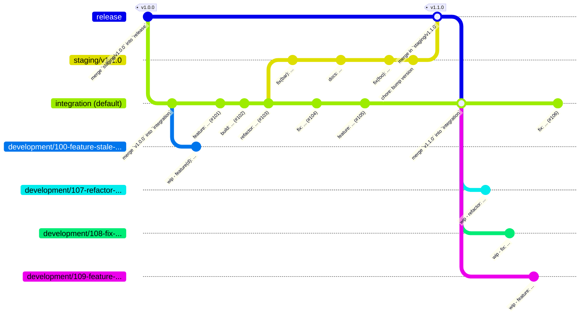

# Branching Strategy

## Overview

This repo uses [GitHub Flow](https://docs.github.com/en/get-started/using-github/github-flow) on top of [git-flow](https://nvie.com/posts/a-successful-git-branching-model/).

## Branch Breakdown

- `development/#-(feature|fix|refactor|etc)-*`: mortal branches where contributors can develop in isolation
  - base: HEAD of `integration`
  - content: commits that can be squashed into a self-contained commit
  - merge target: `integration`
- `integration`: an immortal branch targeted by all development PRs
  - content: only self-contained commits resulting from a squashed PR
  - misnomers:
    - `development`: That's what happens _before_ a PR is merged in, not after
    - `next`: Too vague. What's "next"? A release, a PR, a feature?
    - `main`: Too dependent on perspective.
      - For devs looking to contribute: it's the go-to
      - For users looking to consume: it's a risk
- `staging/v#.#.#`: mortal branches that demarcate a release cutoff without blocking other contributors
  - base: HEAD of `integration`
  - content: only self-contained commits with the bare minimum amount of polish for the next release
    - that are either `fixes: ...`, `docs: ...`, `chores: ...`, etc.
  - merge target: `release`
  - misnomers:
    - `release/v#.#.#`: reserved for immortal branches that are kept for backwards compatibility
- `hotfix/\d--*`: mortal branches to address a mid-cadence emergency.
  - base: HEAD of `release`
  - content: commits that can be squashed into an "atomic" (not "molecular") merge commit
  - merge target: `release`
- `release`: an immortal branch that only contains whole releases
  - code state: stable, deployable, deliverable, production-worthy, etc.
  - content: only merge commits from `staging/v#.#.#` branches
  - misnomers:
    - `main`: Too dependent on perspective.
      - For users looking to consume: it's the go-to
      - For devs looking to contribute: it's not the spot
    - `stable`: could suggest that all other branches are "unstable"
    - `production`: a release _can_ be deployed or delivered to a production environment, but that's beyond git's concern

## Example

## Common Questions

1. _Couldn't the tags themselves serve the same function as the `release` and `integration` branches_?

    Partially, yes, but we'd miss out on:
    - the redundancy of each merge commit on `release` corresponding with an actual version
    - PRs being merged while trying to cut a release, hence having a `staging/v#.#.#` branch as the go-between
    - the clear separation between a stable releases (`release`) and the nightly releases (`integration`)
    - the simplicity of being able to point to `release` and know that this was indeed the latest stable release

1. _Shouldn't the default branch to be the stable one since users will interact with that by default?_

    If users are interacting with a branch, we might have a bigger problem. We don't want _anyone_ interacting with _branches_, but rather:

    - _users_ interacting with _releases_ (via the "Releases" page)
    - _contributors_ interacting with _issues_ and _PRs_
    - _maintainers_ interacting with _users_ and _contributors_

    We delegate _branch_ interaction to GitHub _Actions_ and _rulesets_

1. _Why use a strategy centered around discrete versions when we've got CI/CD?_

    Because we don't have CI/CD, we've got CI/...DD:
    - Discrete stable deliveries every 6 weeks
    - Discrete nightly deliveries every...night

1. _Doesn't this slow down each of our contributors?_

    We sure do hope so, yes.

    Contributor alignment and contribution standards tend to slow some things down to protect the speed of other things such as
    - onboarding new contributors
    - reviewing PRs
    - implementing fixes and features without climbing a mountain of tech debt
