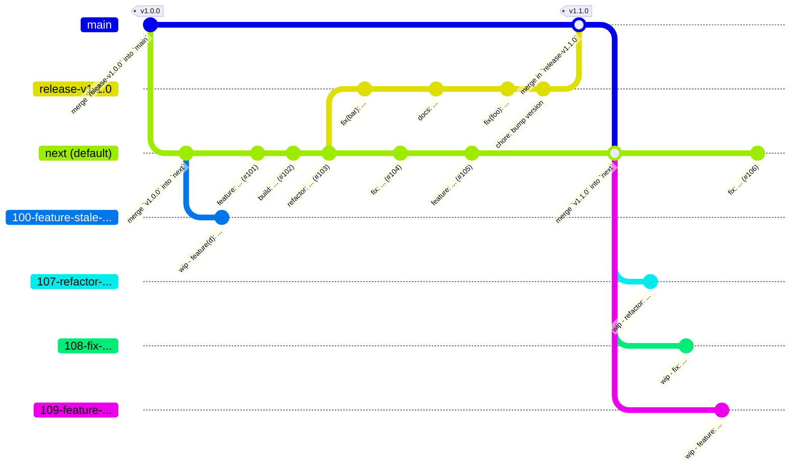

# Branching Strategy

## Overview

This repo uses [GitHub Flow](https://docs.github.com/en/get-started/using-github/github-flow) on top of [git-flow](https://nvie.com/posts/a-successful-git-branching-model/). With this strategy, PRs default to branching off of `next`. And once a PR is accepted, it's branch will be squashed into a single merge commit on `next`

## Example

## Common Questions

1. _Couldn't the tags themselves serve the same function as the `main` and `next` branches_?

    Partially, yes, but we'd miss out on:
    - the redundancy of each merge commit on `main` corresponding with an actual version
    - PRs being merged while trying to cut a release, hence having a `release-*` branch as the go-between
    - the clear separation between a stable releases (`main`) and the nightly releases (`next`)
    - the simplicity of being able to point to `main` and know that this was indeed the latest stable release

1. _Shouldn't the default branch to be the stable one since users will interact with that by default?_

    If users are interacting with a branch, we might have a bigger problem. We don't want _anyone_ interacting with _branches_, but rather:

    - _users_ interacting with _releases_ (via the "Releases" page)
    - _contributors_ interacting with _issues_ and _PRs_
    - _maintainers_ interacting with _users_ and _contributors_

    We delegate _branch_ interaction to GitHub _Actions_ and _rulesets_

1. _Why use a strategy centered around discrete versions when we've got CI/CD?_

    Because we don't have CI/CD, we've got CI/...DD:
    - Discrete stable deliveries every 6 weeks
    - Discrete nightly deliveries every...night

1. _Doesn't this slow down each of our contributors?_

    We sure do hope so, yes.

    Contributor alignment and contribution standards tend to slow some things down to protect the speed of other things such as
    - onboarding new contributors
    - reviewing PRs
    - implementing fixes and features without climbing a mountain of tech debt
